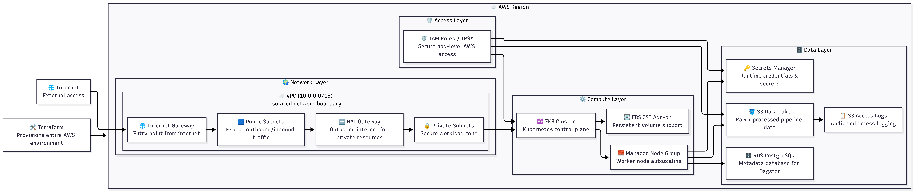
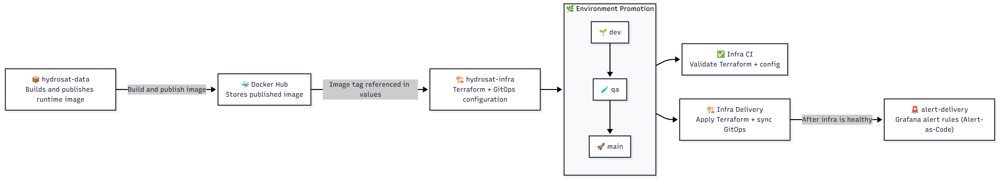

# Sight PoC Infrastructure


Infrastructure and GitOps repository for the Sight PoC platform on AWS. This repo defines the cloud foundation, Kubernetes delivery model, and operational configuration used to run the portfolio project.

It owns the Terraform stacks for core AWS resources, the Helm chart for the application runtime, and the Argo CD manifests that reconcile cluster state from Git. It also carries the supporting delivery workflows used to validate and apply infrastructure changes.

The goal is to keep the infrastructure side lightweight but credible: simple enough for a PoC, but structured around patterns that still resemble real platform engineering practice. The paired application repo is [sight-poc-data](https://github.com/BranfordTGbieor/sight-poc-data), which builds the workload image consumed here.

This repo owns:

- AWS infrastructure with Terraform
- Kubernetes packaging with Helm
- GitOps state with Argo CD
- External Secrets and observability configuration
- infrastructure CI, validation, and delivery workflows

## Stack

| Layer | Choice |
| --- | --- |
| Infrastructure | Terraform |
| Kubernetes delivery | Argo CD |
| Runtime packaging | Helm |
| Secrets | AWS Secrets Manager + External Secrets |
| Observability | Grafana Cloud + Alloy |
| CI/CD | GitHub Actions |

## Architecture



Source: [utils/mermaid/aws-infra.mmd](./utils/mermaid/aws-infra.mmd)

Key choices:

- Terraform provisions AWS network, EKS, platform, and RDS layers
- Argo CD reconciles cluster state from Git
- Helm packages the Dagster runtime shape
- metadata stays in RDS rather than in-cluster Postgres
- observability defaults to Grafana Cloud plus Alloy to keep demo cost lower

For deeper rationale and trade-offs, see [design-notes.md](./design-notes.md).

## Quick Start

Prerequisites:

| Tool | Version | Install docs |
| --- | --- | --- |
| AWS CLI | v2 | [Reference doc to install AWS CLI](https://docs.aws.amazon.com/cli/latest/userguide/getting-started-install.html) |
| Terraform | 1.8.5 | [Reference doc to install Terraform](https://developer.hashicorp.com/terraform/install) |
| kubectl | current stable | [Reference doc to install kubectl](https://kubernetes.io/docs/tasks/tools/) |
| Helm | v3 | [Reference doc to install Helm](https://helm.sh/docs/intro/install/) |
| Docker | current stable | [Reference doc to install Docker](https://docs.docker.com/engine/install/) |
| jq | current stable | [Reference doc to install jq](https://jqlang.org/download/) |

Prepare local Terraform inputs:

```bash
cd terraform
cp backend.hcl.example backend.hcl
cp terraform.tfvars.example terraform.tfvars
```

Example backend config:

```hcl
bucket         = "sight-poc-<unique-suffix>-tf-state"
dynamodb_table = "sight-poc-terraform-locks"
region         = "us-east-1"
key            = "dev/platform.tfstate"
encrypt        = true
```

Provision the main platform:

```bash
terraform init -backend-config=backend.hcl
terraform plan
terraform apply
```

Refresh cluster access:

```bash
aws eks update-kubeconfig \
  --region "$(terraform output -raw aws_region)" \
  --name "$(terraform output -raw cluster_name)"
```

## Validation

Helm:

```bash
helm lint helm/dagster
helm template sight-poc-dagster helm/dagster
```

Terraform:

```bash
terraform init -backend=false
terraform validate
```

Smoke check:

```bash
./scripts/smoke-check.sh
```

Grafana alerting root:

```bash
cd grafana
cp terraform.tfvars.example terraform.tfvars
terraform init
terraform plan
```

## CI and Delivery



Source: [utils/mermaid/delivery.mmd](./utils/mermaid/delivery.mmd)

Delivery workflows are manual by design:

- `terraform-delivery.yml` applies the main platform stack
- `grafana-alerting-delivery.yml` applies the separate Grafana root

Branch mapping for this PoC:

- `main` -> `dev`
- `tes` -> `test`
- `prod` -> `prod`

GitHub Environments:

- `main` uses the `dev` environment by default
- `tes` maps to `test`
- `prod` maps to `prod`

## AI Assistance Disclosure

This repository was authored and manually reviewed by Branford T. Gbieor with AI assistance used for drafting, refactoring, and documentation support. Final implementation choices and committed changes were reviewed by the author.
