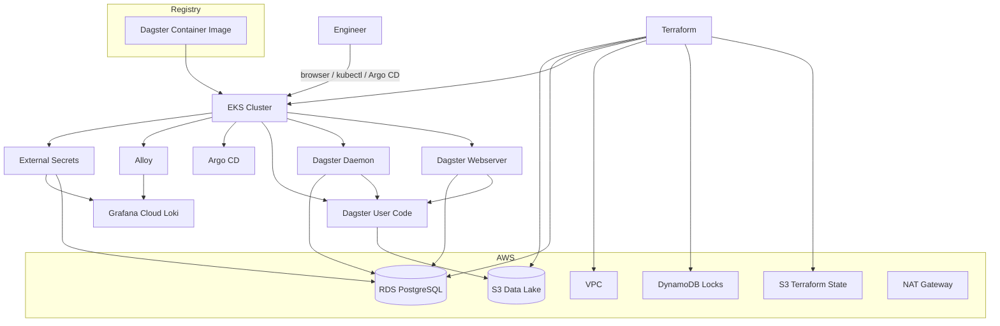

# Hydrosat Infrastructure


Infrastructure and GitOps repository for the Hydrosat Dagster platform on AWS.

This repository owns:

- Terraform infrastructure on AWS
- the Dagster Helm chart and runtime packaging
- Argo CD app-of-apps manifests
- observability stack configuration
- External Secrets resources
- infrastructure CI and governed Terraform delivery

The Dagster application source code, tests, and container build live in the separate `hydrosat-data` repository. This repo consumes a pre-built image and reconciles the platform state from Git.

## Table of Contents

- [Overview](#overview)
- [Repository Layout](#repository-layout)
- [Architecture](#architecture)
- [Deployment Model](#deployment-model)
- [Operational Decisions](#operational-decisions)
- [Provisioning](#provisioning)
- [Usage and Validation](#usage-and-validation)
- [CI and Delivery](#ci-and-delivery)
- [Security](#security)
- [Cost Justification and Trade-Offs](#cost-justification-and-trade-offs)
- [Backup, Restore, and Upgrade Notes](#backup-restore-and-upgrade-notes)
- [Submission Checklist](#submission-checklist)
- [Destroy](#destroy)

## Overview

This implementation aims to go beyond the minimum assignment by showing a defensible operating model:

- Terraform owns AWS infrastructure
- Argo CD owns steady-state Kubernetes delivery
- Helm packages the Dagster runtime
- External Secrets syncs runtime secrets from AWS Secrets Manager
- Grafana Cloud is the default observability backend for the lighter demo profile

The platform remains intentionally demo-scoped. Argo CD and the observability stack run in the same cluster to keep bootstrap complexity and cloud cost under control, while still leaving a clear path toward a fuller production setup.

This repo is the infrastructure half of a split-repo model:

- `hydrosat-data` owns Dagster jobs, tests, and image build concerns
- `hydrosat-infra` owns infrastructure, packaging, GitOps, and environment promotion concerns

## At a Glance

| Layer | Choice in this repo | Why |
| --- | --- | --- |
| Infrastructure | Terraform on AWS | Clean ownership of network, EKS, platform, and RDS layers |
| Runtime Packaging | Helm | Keeps deploy shape separate from Dagster application source |
| Delivery | Argo CD | GitOps as the steady-state deployment path |
| Secrets | AWS Secrets Manager + External Secrets | Keeps credentials out of Git and Helm values |
| Data Lake | S3-backed raw, staging, and curated layers | Supports the layered Dagster sample pipeline and future dbt work |
| Observability | Grafana Cloud + Alloy | Keeps demo observability lightweight while preserving centralized logs |
| CI/CD | GitHub Actions | Separate infra validation and governed Terraform delivery |

## Repository Layout

| Path | Purpose |
| --- | --- |
| `terraform/` | Main AWS platform stack |
| `terraform/modules/` | Reusable infrastructure modules |
| `helm/dagster/` | Dagster Helm chart |
| `gitops/argocd/` | Argo CD bootstrap, project, apps, and Helm values |
| `gitops/external-secrets/` | Secret sync resources |
| `.github/workflows/ci.yml` | Infra validation workflow |
| `.github/workflows/terraform-delivery.yml` | Governed Terraform plan/apply workflow |

Separation of concerns:

- `terraform/` owns cloud infrastructure lifecycle
- `helm/` owns runtime packaging
- `gitops/` owns reconciliation and steady-state delivery
- the Dagster application code lives outside this repo in `hydrosat-data`

## Architecture



## Deployment Model

### Infrastructure

Terraform in this repo focuses on the platform stack in `terraform/`.

Remote backend resources such as the S3 state bucket and DynamoDB lock table are treated as a one-time prerequisite rather than first-class infrastructure code in this repository.

The platform stack is decomposed into:

- `network`
- `eks`
- `platform`
- `rds`

That keeps the repo focused on the actual platform while still supporting a standard remote-state workflow.

### Kubernetes and Dagster

Dagster runs as:

- webserver deployment
- daemon deployment
- gRPC user-code deployment

Important workload choices:

- metadata lives in Amazon RDS, not in-cluster Postgres
- schema migrations run as a dedicated Helm hook job
- rolling updates, health probes, topology spreading, and conditional PDBs are configured in the chart
- the user-code workload is protected with a `NetworkPolicy`
- containers run as non-root with explicit security context

The application image is expected to come from the separate `hydrosat-data` repository. This infra repo is responsible for consuming a reviewed image tag, not building application code.

### GitOps

Argo CD is the primary steady-state deployment path.

Key manifests:

- `gitops/argocd/bootstrap/root-application.yaml`
- `gitops/argocd/apps/project.yaml`
- `gitops/argocd/apps/hydrosat-dagster.yaml`
- `gitops/argocd/apps/monitoring-alloy.yaml`
- `gitops/argocd/apps/external-secrets-operator.yaml`
- `gitops/argocd/apps/external-secrets-resources.yaml`

For this exercise, Argo CD runs in the same cluster it manages. That is a deliberate demo trade-off:

- simpler bootstrap
- lower AWS cost
- easier end-to-end review

For a larger estate, I would separate the management plane from workload clusters.

### Observability

The default observability path is now intentionally lighter:

| Concern | Tool |
| --- | --- |
| Log collection | Alloy |
| Log storage and search | Grafana Cloud Loki |
| Dashboards and exploration | Grafana Cloud |

This keeps the cluster cheaper and easier to bring up repeatedly for a demo while still showing a credible centralized observability path. A heavier in-cluster LGTM stack remains a possible future option, but it is no longer the default bring-up path for this repository.

## Operational Decisions

### Job Failure Alerting

Dagster remains the source of truth for job-failure semantics. The chart still supports an Alertmanager URL, but the default GitOps profile leaves it blank so the platform can come up without the heavier in-cluster alerting stack.

That keeps the demo bootstrap cheaper and simpler while leaving room to add Grafana Cloud alerting or a separate alerting path later.

Current recommendation:

- use Grafana Cloud-managed alerting for this repo's default observability path
- configure alert rules and notification policies in Grafana Cloud first, rather than reintroducing in-cluster Alertmanager
- document the chosen rules and contact points in this repo even if the first implementation is created through the Grafana Cloud UI

Recommended first alert set:

- Alloy export/auth failures
- Dagster webserver unavailable
- Dagster daemon unavailable
- repeated Dagster error logs in Grafana Cloud Loki
- absence of expected Dagster workload logs over a recent window

### Secrets Management

AWS Secrets Manager is the source of truth for:

- Dagster database credentials
- Grafana Cloud logs and metrics credentials

External Secrets Operator syncs those values into Kubernetes Secrets.

Relevant resources:

- `gitops/external-secrets/cluster-secret-store.yaml`
- `gitops/external-secrets/dagster-db-external-secret.yaml`
- `gitops/external-secrets/grafana-cloud-external-secret.yaml`

This is materially better than embedding Grafana Cloud endpoints or tokens directly in Helm values or committing them into Git.

### Data Lake Storage

The platform now provisions an S3-backed data lake bucket for the Dagster sample pipeline.

Current logical layout:

- `raw/satellite_observations/...`
- `staging/satellite_observations/...`
- `curated/tile_summary/...`

Dagster accesses the bucket through an IRSA-bound service account role rather than static AWS credentials.
The paired `hydrosat-data` repo now uses Python for `raw` ingestion and dbt-backed DuckDB transforms for the `staging` and `curated` layers before exporting those results back into the lake layout.

### Secret Rotation Lifecycle

Secret rotation behavior is explicit:

- Dagster DB secret refresh interval: `1h`
- Grafana Cloud secret refresh interval: `15m`

Operational model:

1. Rotate or update the value in AWS Secrets Manager.
2. Wait for External Secrets to reconcile the Kubernetes Secret.
3. Restart Alloy workloads if Grafana Cloud credentials changed, because the credentials are loaded through `envFrom`.
4. Restart Dagster workloads if the rotated value affects environment-sourced database credentials.
5. Validate application health and observability export.

### Networking and Access

Networking decisions:

- two public and two private subnets across AZs
- EKS worker nodes in private subnets
- single NAT gateway to stay cost-conscious for the exercise
- Dagster UI exposed through a Kubernetes `LoadBalancer`
- EKS private endpoint access enabled, with public access still available for easier bootstrap

The public endpoint can be narrowed through `cluster_endpoint_public_access_cidrs`. For a longer-lived environment, I would typically disable public endpoint access after bootstrap.

## Provisioning

### Prerequisites

- AWS account and credentials
- `terraform`
- `aws`
- `kubectl`
- `helm`
- `docker`
- `jq`

### 1. Prepare Terraform Inputs

Create the backend config:

```bash
cd terraform
cp backend.hcl.example backend.hcl
```

Create local Terraform inputs:

```bash
cp terraform.tfvars.example terraform.tfvars
```

Local-only files:

| File | Purpose |
| --- | --- |
| `terraform/backend.hcl` | Backend configuration for `terraform init` |
| `terraform/terraform.tfvars` | Local Terraform inputs |
| `.env` | Optional convenience environment values |

### 2. Prepare the Terraform Backend

Create the S3 state bucket and DynamoDB lock table once in your AWS account by whatever standard method your team prefers. For this exercise, a one-time manual creation is acceptable and keeps the repo simpler.

Then populate `terraform/backend.hcl` with the backend values:

```hcl
bucket         = "hydrosat-<unique-suffix>-tf-state"
dynamodb_table = "hydrosat-terraform-locks"
region         = "us-east-1"
key            = "dev/platform.tfstate"
encrypt        = true
```

### 3. Provision the Platform

Main platform flow:

```bash
terraform init -backend-config=backend.hcl
terraform plan
terraform apply
```

Useful optional inputs:

- `extra_tags` for organization-specific tagging
- `cluster_endpoint_public_access_cidrs` to narrow API exposure
- `grafana_cloud_secret_arn` to scope External Secrets access to the Grafana Cloud secret

### 4. Configure `kubectl`

```bash
aws eks update-kubeconfig \
  --region "$(terraform output -raw aws_region)" \
  --name "$(terraform output -raw cluster_name)"
```

### 5. Prepare the Dagster Image

The application image is expected to be built and published from `hydrosat-data`.

This infra repo consumes an explicit image repository and tag through the Helm chart. In the implemented split-repo flow, `hydrosat-data` publishes application images to Docker Hub and version-tag releases trigger this repo to update the deployed image tag through GitOps-managed values.

### 6. Prepare Secrets Manager Inputs

The GitOps flow expects:

1. The RDS master secret created by Terraform.
2. A separate secret for Grafana Cloud Loki credentials.

Example Grafana Cloud logs secret payload:

```json
{
  "logsUrl": "https://logs-prod-<stack>.grafana.net/loki/api/v1/push",
  "logsUsername": "<stack-user-or-tenant-id>",
  "logsPassword": "<grafana-cloud-access-policy-token>",
  "metricsUrl": "https://prometheus-prod-<stack>.grafana.net/api/prom/push",
  "metricsUsername": "<stack-user-or-tenant-id>",
  "metricsPassword": "<grafana-cloud-access-policy-token>"
}
```

To avoid re-editing ARNs and Terraform outputs after every fresh apply, use:

```bash
GRAFANA_CLOUD_SECRET_ARN=arn:aws:secretsmanager:... \
./scripts/sync-live-config.sh
```

### 7. Deploy with Argo CD

This is the preferred steady-state path.

Before bootstrap:

1. Ensure the Grafana Cloud secret exists in AWS Secrets Manager.
2. Run `./scripts/sync-live-config.sh` with the Grafana Cloud secret ARN exported.
3. Review and commit the generated GitOps changes.

Then apply the root application:

```bash
kubectl apply -f gitops/argocd/bootstrap/root-application.yaml
```

### 8. Deploy Imperatively with Helm

This path is for local validation and break-glass troubleshooting, not steady-state operations.

```bash
helm upgrade --install hydrosat-dagster ./helm/dagster \
  --namespace dagster \
  --create-namespace \
  --set image.repository="REPLACE_WITH_DAGSTER_IMAGE_REPOSITORY" \
  --set image.tag=latest \
  --set database.secretName=hydrosat-dagster-db
```

## Usage and Validation

### Access Dagster

```bash
kubectl get svc hydrosat-dagster-webserver -n dagster
```

Dagster endpoints:

- UI: `http://<load-balancer-host>/`
- GraphQL: `http://<load-balancer-host>/graphql`

Local port-forward option:

```bash
kubectl port-forward svc/hydrosat-dagster-webserver -n dagster 3000:80
```

### Run the Demo Job

The demo job and its run config live in the separate `hydrosat-data` repository. The expected validation flow remains:

- run with `should_fail: false` to prove normal execution
- run with `should_fail: true` to trigger controlled failure and alert routing

### Log Validation

Validation flow:

1. Confirm External Secrets is healthy.
2. Confirm `hydrosat-dagster-db` exists in `dagster`.
3. Confirm `hydrosat-grafana-cloud` exists in `monitoring`.
4. Launch `hydrosat_demo_job` from the Dagster UI or API.
5. Confirm Dagster pods emit logs locally.
6. Confirm Alloy forwards those logs to Grafana Cloud.

### Alert Validation

Recommended first alerting flow in Grafana Cloud:

1. Create contact points and notification policies in Grafana Cloud.
2. Add a small first set of alert rules based on the exported metrics and logs.
3. Trigger one controlled failure case from Dagster.
4. Confirm the alert fires and reaches the expected notification target.

For this exercise, manual alert configuration in the Grafana Cloud UI is acceptable and keeps the repo simpler. If the alert footprint grows, the next step would be to evaluate whether alert provisioning should move into code.

### Local Verification

Helm checks:

```bash
helm lint helm/dagster
helm template hydrosat-dagster helm/dagster
```

Terraform checks:

```bash
terraform init -backend=false
terraform validate
```

## CI and Delivery

### CI Workflow

Branch CI lives in [ci.yml](.github/workflows/ci.yml).

It covers:

- Terraform formatting
- Checkov security scanning
- Terraform validation for `terraform/`
- Helm lint for the Dagster chart
- Helm rendering for Dagster and GitOps-managed charts

### Terraform Delivery Workflow

Governed Terraform delivery lives in [terraform-delivery.yml](.github/workflows/terraform-delivery.yml).

Design choices:

- PRs can run Terraform plan when delivery variables are configured
- `apply` is separate from general CI
- `apply` is intended to be protected by GitHub Environment approval rules
- environment is derived from branch naming rather than manual workflow inputs

Branch-to-environment mapping:

- `develop` or `dev` -> `dev`
- `qa` -> `qa`
- `main` or `master` -> `prod`

Tagging model:

- `Environment` remains the canonical stable environment tag
- `GitRef` can be added as secondary traceability metadata

### GitHub Environment Protection

For the intended CI-only apply model, create GitHub Environments named `dev`, `qa`, and `prod` in the `hydrosat-infra` repository and attach protection rules to them.

Recommended baseline:

- `dev`: optional reviewer gate, mainly used to exercise the workflow end to end
- `qa`: at least one required reviewer before `Terraform Apply`
- `prod`: at least one required reviewer, ideally two if the team is large enough

Recommended environment-scoped variables:

- `AWS_TERRAFORM_ROLE_ARN`
- `TF_STATE_BUCKET`
- `TF_LOCK_TABLE`
- `AWS_REGION`

Recommended environment-scoped secrets when needed later:

- any future Terraform provider credentials that should not be repository-wide
- any release or notification tokens that should differ between `dev`, `qa`, and `prod`

Expected operator flow:

1. push or open a PR on the environment-mapped branch
2. let `Terraform Plan` run automatically
3. review the uploaded plan artifact
4. trigger `Terraform Delivery` manually when ready
5. approve the environment gate in GitHub
6. let `Terraform Apply` run with the reviewed plan artifact

### Release Ownership Model

The split-repo model is intended to mirror the cleaner long-term operating model:

- application changes build and publish a Dagster image from `hydrosat-data`
- infrastructure changes own Helm values, Argo CD application state, and environment promotion in `hydrosat-infra`
- version-tagged application releases automatically update the image tag consumed here through a bot commit in `hydrosat-infra`

## Live Demo Placeholder Inventory

Before a real demo deployment, keep the repo generic and use the sync helper to inject the current live values after each fresh Terraform apply.

Files refreshed by `./scripts/sync-live-config.sh`:

- `gitops/argocd/values/external-secrets-values.yaml`
- `gitops/external-secrets/cluster-secret-store.yaml`
- `gitops/external-secrets/dagster-db-external-secret.yaml`
- `gitops/external-secrets/grafana-cloud-external-secret.yaml`
- `gitops/argocd/values/alloy-values.yaml`
- `helm/dagster/values-gitops.yaml`

Inputs required by the sync script:

1. current Terraform outputs from the applied environment
2. `GRAFANA_CLOUD_SECRET_ARN`

The only intentionally generic chart placeholder left after that is:

- `helm/dagster/values.yaml`
  - `REPLACE_WITH_CONTAINER_IMAGE_REPOSITORY`

That file is not the GitOps source of truth; Argo CD uses `helm/dagster/values-gitops.yaml`.

## Security

Included security posture:

| Practice | Implementation |
| --- | --- |
| Remote state protection | S3 versioning, encryption, public access block, DynamoDB locking |
| Private data plane | RDS in private subnets |
| Secret management | AWS Secrets Manager plus External Secrets |
| Runtime hardening | Non-root pods and explicit security contexts |
| Pod-level isolation | `NetworkPolicy` for user-code gRPC |
| CI security scanning | Checkov in GitHub Actions |

Resource tags include:

- `Project`
- `Environment`
- `ManagedBy`
- `Repository`
- `Component`
- `Name`

`extra_tags` remains available for cost center, owner, or compliance metadata.

## Cost Justification and Trade-Offs

### Sizing

Current demo defaults are intentionally modest:

- EKS node group: `t3.small`, `min=2`, `desired=2`, `max=3`
- RDS: PostgreSQL 16 on `db.t4g.micro`, `Multi-AZ = false`
- VPC Flow Logs: enabled with `7d` retention
- RDS Performance Insights: disabled
- RDS Enhanced Monitoring: disabled
- observability data plane: Grafana Cloud-managed, with Alloy shipping logs out of cluster

The goal is to keep the review environment inexpensive without changing the overall platform shape.

### Demo vs Production Defaults

| Area | Demo default in repo | Production-leaning recommendation | Why |
| --- | --- | --- | --- |
| EKS nodes | `t3.small`, `min=2`, `desired=2`, `max=3` | start at `min=2`, `desired=2`, `max=4+` with sizing based on real load | two nodes are still the minimum sane baseline once Dagster, Argo CD, and observability share a cluster |
| RDS topology | `db.t4g.micro`, `Multi-AZ = false` | `db.t4g.small` or higher, `Multi-AZ = true` | the demo optimizes cost; production should optimize availability first |
| RDS storage | `20 GiB`, autoscale to `100 GiB` | keep autoscaling, raise floor only if usage justifies it | autoscaling is already the better pattern than fixed overprovisioning |
| VPC Flow Logs | enabled, `7d` retention | `30d+` retention or org-standard log archival | short retention preserves the network-visibility story without paying for a long audit window |
| RDS telemetry | Performance Insights and Enhanced Monitoring disabled | enable both when deeper DB troubleshooting justifies the spend | optional RDS telemetry is easy to restore later, but not necessary for a short-lived demo |
| Observability | Grafana Cloud for logs, no heavy local LGTM stack by default | choose Grafana Cloud or a right-sized self-hosted stack per environment | the demo path optimizes for repeatable bring-up cost and lower cluster pressure |
| Exposure | `LoadBalancer` for Dagster only | ingress controller plus TLS and host-based routing | direct exposure is simpler for review, ingress is cleaner once multiple services need external access |

Why the EKS node group is sized this way:

- `min=2` avoids a fragile single-node cluster and gives the control-plane addons, observability stack, and Dagster workloads room to spread
- `desired=2` keeps the baseline cost stable while still supporting zone-aware scheduling and rolling updates
- `max=3` provides limited burst headroom for upgrades, temporary rescheduling pressure, and demo load without turning this into an oversized cluster
- `t3.small` is the cheapest worker size I would use here while still keeping the cluster private, multi-node, and capable of hosting Dagster plus the shared platform services

Why the RDS instance is sized this way:

- Dagster metadata traffic is light in this exercise, so `db.t4g.micro` is enough for orchestration state, run history, and event logs
- Multi-AZ is disabled in the demo because it is one of the clearest avoidable cost multipliers in a short-lived review environment
- storage starts at `20 GiB` on `gp3` and can autoscale to `100 GiB`, which is a better demo default than overprovisioning fixed storage up front
- backup retention and CloudWatch log exports remain enabled because they keep the database operationally defensible without a large cost jump
- Performance Insights and Enhanced Monitoring are disabled by default because they are useful but not essential for a short-lived review environment

Production note:

- for a longer-lived environment, I would flip `db_multi_az = true` immediately and revisit the instance class after observing real connection count, storage growth, and maintenance expectations

This sizing is appropriate for a review environment while still showing the correct production direction: externalized metadata, multi-node cluster baseline, and room for controlled scale-out.

### Network Telemetry

- VPC Flow Logs stay enabled so the architecture still demonstrates a reasonable network-audit posture
- retention is trimmed to `7` days because `365` days was unnecessary for a disposable demo environment
- if the goal were absolute minimum cost, VPC Flow Logs are one of the first features I would disable entirely

### Autoscaling Direction

The current cluster uses managed node group scaling only:

- floor: `2`
- steady state: `2`
- burst ceiling: `3`

That is intentional for a take-home because it keeps behavior predictable during review. For a longer-lived environment, I would move toward:

- pod-level autoscaling for stateless Dagster-facing services where metrics justify it
- cluster-level node scaling with Karpenter or Cluster Autoscaler once workload patterns are better understood
- separate sizing and scaling policies for observability components if they begin competing with Dagster workloads

I would not add aggressive autoscaling sooner than that. Early over-automation tends to hide capacity assumptions instead of making them clearer.

### Ingress and Exposure Trade-Offs

The current repo exposes Dagster through a Kubernetes `LoadBalancer` service instead of introducing an ingress controller.

Why this is acceptable here:

- it keeps the bootstrap path simple
- it makes the UI easy for a reviewer to access
- it avoids adding another controller, another chart, and another TLS/DNS story before the core platform is complete

Why I would revisit it later:

- an ingress controller becomes more attractive once there are multiple services to expose
- it gives better control over host-based routing, TLS policy, and access controls
- it is the cleaner path if Grafana, Argo CD, and Dagster all need polished external access patterns

### Demo-Scoped Choices

These are deliberate trade-offs for the exercise:

- same-cluster Argo CD rather than separate management cluster
- Grafana Cloud rather than a heavier self-hosted LGTM stack by default
- single NAT gateway rather than fully redundant NAT per AZ
- public Dagster UI exposure via `LoadBalancer` for easier review

## Backup, Restore, and Upgrade Notes

### Backup and Restore

- RDS automated backups remain enabled with a `7` day retention window
- RDS snapshots inherit tags via `copy_tags_to_snapshot = true`
- the Terraform state backend relies on S3 versioning and DynamoDB locking, so state recovery is separate from application recovery
- for this demo, the most important restore validation is confirming Dagster can reconnect to RDS and resume scheduling after database recovery

### Upgrade Posture

- Terraform changes should continue to flow through `plan` before `apply`
- Dagster schema changes are handled by the dedicated Helm migration job before the main workloads roll
- GitOps-managed platform components should be upgraded by changing pinned chart versions or values in Git rather than through imperative `helm upgrade`
- database class, topology, and storage changes should be treated as separate, reviewed changes because they can affect cost and availability behavior

### Rollback Notes

- application rollback should prefer reverting the GitOps commit and letting Argo CD reconcile back to the previous known-good state
- alerting and secret configuration rollback should happen first in AWS Secrets Manager when the issue is secret-driven
- database credential rollback still requires Dagster workloads to be restarted after External Secrets reconciles the old value

## Submission Checklist

- CI green on the branch being presented
- Terraform defaults remain demo-safe and cost-conscious
- README placeholders replaced where needed for the live demo environment
- Argo CD bootstrap path and imperative fallback path both documented
- Alert routing, secret management, and cost trade-offs are easy to explain in a walkthrough
- destroy flow understood before leaving resources running in AWS

## Destroy

Imperative application cleanup:

```bash
helm uninstall hydrosat-dagster -n dagster
terraform destroy
```

Optional remote backend cleanup:

```bash
aws dynamodb delete-table --table-name hydrosat-terraform-locks
aws s3 rb s3://hydrosat-<unique-suffix>-tf-state --force
```
