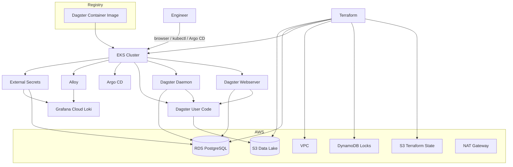

# Hydrosat Infrastructure


Infrastructure and GitOps repository for the Hydrosat Dagster platform on AWS.

This repository owns:

- Terraform infrastructure on AWS
- the Dagster Helm chart and runtime packaging
- Argo CD app-of-apps manifests
- observability stack configuration
- External Secrets resources
- infrastructure CI and governed Terraform delivery

The Dagster application source code, tests, and container build live in the separate `hydrosat-data` repository. This repo consumes a pre-built image and reconciles the platform state from Git.

## Table of Contents

- [Overview](#overview)
- [Repository Layout](#repository-layout)
- [Architecture](#architecture)
- [Deployment Model](#deployment-model)
- [Design Notes](#design-notes)
- [Provisioning](#provisioning)
- [Usage and Validation](#usage-and-validation)
- [CI and Delivery](#ci-and-delivery)
- [Security](#security)
- [Submission Checklist](#submission-checklist)
- [Destroy](#destroy)

## Overview

This implementation aims to go beyond the minimum assignment by showing a defensible operating model:

- Terraform owns AWS infrastructure
- Argo CD owns steady-state Kubernetes delivery
- Helm packages the Dagster runtime
- External Secrets syncs runtime secrets from AWS Secrets Manager
- Grafana Cloud is the default observability backend for the lighter demo profile

The platform remains intentionally demo-scoped. Argo CD and the observability stack run in the same cluster to keep bootstrap complexity and cloud cost under control, while still leaving a clear path toward a fuller production setup.

This repo is the infrastructure half of a split-repo model:

- `hydrosat-data` owns Dagster jobs, tests, and image build concerns
- `hydrosat-infra` owns infrastructure, packaging, GitOps, and environment promotion concerns

## At a Glance

| Layer | Choice in this repo | Why |
| --- | --- | --- |
| Infrastructure | Terraform on AWS | Clean ownership of network, EKS, platform, and RDS layers |
| Runtime Packaging | Helm | Keeps deploy shape separate from Dagster application source |
| Delivery | Argo CD | GitOps as the steady-state deployment path |
| Secrets | AWS Secrets Manager + External Secrets | Keeps credentials out of Git and Helm values |
| Data Lake | S3-backed raw, staging, and curated layers | Supports the layered Dagster sample pipeline and future dbt work |
| Observability | Grafana Cloud + Alloy | Keeps demo observability lightweight while preserving centralized logs |
| CI/CD | GitHub Actions | Separate infra validation and governed Terraform delivery |

## Repository Layout

| Path | Purpose |
| --- | --- |
| `terraform/` | Main AWS platform stack |
| `terraform/modules/` | Reusable infrastructure modules |
| `grafana/` | Separate Terraform root for Grafana Cloud alerting resources |
| `helm/dagster/` | Dagster Helm chart |
| `gitops/argocd/` | Argo CD bootstrap, project, apps, and Helm values |
| `gitops/external-secrets/` | Secret sync resources |
| `.github/workflows/ci.yml` | Infra validation workflow |
| `.github/workflows/terraform-delivery.yml` | Governed Terraform plan/apply workflow |

Separation of concerns:

- `terraform/` owns cloud infrastructure lifecycle
- `helm/` owns runtime packaging
- `gitops/` owns reconciliation and steady-state delivery
- the Dagster application code lives outside this repo in `hydrosat-data`

## Architecture



## Deployment Model

### Infrastructure

Terraform in this repo focuses on the platform stack in `terraform/`.

Remote backend resources such as the S3 state bucket and DynamoDB lock table are treated as a one-time prerequisite rather than first-class infrastructure code in this repository.

The platform stack is decomposed into:

- `network`
- `eks`
- `platform`
- `rds`

That keeps the repo focused on the actual platform while still supporting a standard remote-state workflow.

### Kubernetes and Dagster

Dagster runs as:

- webserver deployment
- daemon deployment
- gRPC user-code deployment

Important workload choices:

- metadata lives in Amazon RDS, not in-cluster Postgres
- schema migrations run as a dedicated Helm hook job
- rolling updates, health probes, topology spreading, and conditional PDBs are configured in the chart
- the user-code workload is protected with a `NetworkPolicy`
- containers run as non-root with explicit security context

The application image is expected to come from the separate `hydrosat-data` repository. This infra repo is responsible for consuming a reviewed image tag, not building application code.

### GitOps

Argo CD is the primary steady-state deployment path.

Key manifests:

- `gitops/argocd/bootstrap/root-application.yaml`
- `gitops/argocd/apps/project.yaml`
- `gitops/argocd/apps/hydrosat-dagster.yaml`
- `gitops/argocd/apps/monitoring-alloy.yaml`
- `gitops/argocd/apps/external-secrets-operator.yaml`
- `gitops/argocd/apps/external-secrets-resources.yaml`

For this exercise, Argo CD runs in the same cluster it manages. That is a deliberate demo trade-off:

- simpler bootstrap
- lower AWS cost
- easier end-to-end review

For a larger estate, I would separate the management plane from workload clusters.

### Observability

The default observability path is now intentionally lighter:

| Concern | Tool |
| --- | --- |
| Log collection | Alloy |
| Log storage and search | Grafana Cloud Loki |
| Dashboards and exploration | Grafana Cloud |

This keeps the cluster cheaper and easier to bring up repeatedly for a demo while still showing a credible centralized observability path. A heavier in-cluster LGTM stack remains a possible future option, but it is no longer the default bring-up path for this repository.

Current coverage includes:

- Kubernetes pod logs shipped by Alloy
- Kubernetes events shipped as logs
- Alloy self-metrics
- Dagster workload logs for `webserver`, `daemon`, and `user-code`

This is still intentionally lighter than a full in-cluster monitoring stack, but it gives a useful platform-level baseline for a demo and for Grafana Cloud alerting without duplicating low-value infrastructure metrics that AWS already exposes elsewhere.

## Design Notes

For design choices, trade-offs, production considerations, and implementation rationale, see [design-notes.md](./design-notes.md).

## Provisioning

### Prerequisites

- AWS account and credentials
- `terraform`
- `aws`
- `kubectl`
- `helm`
- `docker`
- `jq`

### 1. Prepare Terraform Inputs

Create the backend config:

```bash
cd terraform
cp backend.hcl.example backend.hcl
```

Create local Terraform inputs:

```bash
cp terraform.tfvars.example terraform.tfvars
```

Local-only files:

| File | Purpose |
| --- | --- |
| `terraform/backend.hcl` | Backend configuration for `terraform init` |
| `terraform/terraform.tfvars` | Local Terraform inputs |
| `.env` | Optional convenience environment values |

### 2. Prepare the Terraform Backend

Create the S3 state bucket and DynamoDB lock table once in your AWS account by whatever standard method your team prefers. For this exercise, a one-time manual creation is acceptable and keeps the repo simpler.

Then populate `terraform/backend.hcl` with the backend values:

```hcl
bucket         = "hydrosat-<unique-suffix>-tf-state"
dynamodb_table = "hydrosat-terraform-locks"
region         = "us-east-1"
key            = "dev/platform.tfstate"
encrypt        = true
```

### 3. Provision the Platform

Main platform flow:

```bash
terraform init -backend-config=backend.hcl
terraform plan
terraform apply
```

Useful optional inputs:

- `extra_tags` for organization-specific tagging
- `cluster_endpoint_public_access_cidrs` to narrow API exposure
- `grafana_cloud_secret_arn` to scope External Secrets access to the Grafana Cloud secret

### 4. Configure `kubectl`

```bash
aws eks update-kubeconfig \
  --region "$(terraform output -raw aws_region)" \
  --name "$(terraform output -raw cluster_name)"
```

### 5. Prepare the Dagster Image

The application image is expected to be built and published from `hydrosat-data`.

This infra repo consumes an explicit image repository and tag through the Helm chart. In the implemented split-repo flow, `hydrosat-data` publishes application images to Docker Hub and version-tag releases trigger this repo to update the deployed image tag through GitOps-managed values.

### 6. Prepare Secrets Manager Inputs

The GitOps flow expects:

1. The RDS master secret created by Terraform.
2. A separate secret for Grafana Cloud Loki credentials.
3. A Grafana service account token for the separate `grafana/` alerting Terraform root if you want alert-as-code.

Example Grafana Cloud logs secret payload:

```json
{
  "logsUrl": "https://logs-prod-<stack>.grafana.net/loki/api/v1/push",
  "logsUsername": "<stack-user-or-tenant-id>",
  "logsPassword": "<grafana-cloud-access-policy-token>",
  "metricsUrl": "https://prometheus-prod-<stack>.grafana.net/api/prom/push",
  "metricsUsername": "<stack-user-or-tenant-id>",
  "metricsPassword": "<grafana-cloud-access-policy-token>"
}
```

To avoid re-editing ARNs and Terraform outputs after every fresh apply, use:

```bash
GRAFANA_CLOUD_SECRET_ARN=arn:aws:secretsmanager:... \
./scripts/sync-live-config.sh
```

### 7. Deploy with Argo CD

This is the preferred steady-state path.

Before bootstrap:

1. Ensure the Grafana Cloud secret exists in AWS Secrets Manager.
2. Run `./scripts/sync-live-config.sh` with the Grafana Cloud secret ARN exported.
3. Review and commit the generated GitOps changes.

Then apply the root application:

```bash
kubectl apply -f gitops/argocd/bootstrap/root-application.yaml
```

### 8. Deploy Imperatively with Helm

This path is for local validation and break-glass troubleshooting, not steady-state operations.

```bash
helm upgrade --install hydrosat-dagster ./helm/dagster \
  --namespace dagster \
  --create-namespace \
  --set image.repository="REPLACE_WITH_DAGSTER_IMAGE_REPOSITORY" \
  --set image.tag=latest \
  --set database.secretName=hydrosat-dagster-db
```

## Usage and Validation

### Access Dagster

```bash
kubectl get svc hydrosat-dagster-webserver -n dagster
```

Dagster endpoints:

- UI: `http://<load-balancer-host>/`
- GraphQL: `http://<load-balancer-host>/graphql`

Local port-forward option:

```bash
kubectl port-forward svc/hydrosat-dagster-webserver -n dagster 3000:80
```

### Run the Demo Job

The demo job and its run config live in the separate `hydrosat-data` repository. The expected validation flow remains:

- run with `should_fail: false` to prove normal execution
- run with `should_fail: true` to trigger controlled failure and alert routing

Validated state:

- a successful Dagster run completed on the 3-node demo cluster
- a controlled failure run completed with the expected Dagster `RUN_FAILURE`
- the pipeline wrote demo data into the S3-backed lake layout
- the application release and infra image-promotion workflow were exercised end to end

Current validation status:

- cluster bring-up is repeatable through Terraform, GitOps sync, Argo CD bootstrap, and the repo smoke check
- Dagster steady state is healthy on the smaller 3-node cluster profile
- success and controlled failure runs are both proven
- Grafana Cloud ingestion of Dagster workload logs is proven
- notification delivery from Grafana Cloud alerting is the main remaining live validation item

### Log Validation

Validation flow:

1. Confirm External Secrets is healthy.
2. Confirm `hydrosat-dagster-db` exists in `dagster`.
3. Confirm `hydrosat-grafana-cloud` exists in `monitoring`.
4. Launch `hydrosat_lakehouse_job` from the Dagster UI or API.
5. Confirm Dagster pods emit logs locally.
6. Confirm Alloy forwards those logs to Grafana Cloud.
7. Confirm Kubernetes events appear in Grafana Cloud logs.

Useful LogQL examples:

```logql
{cluster="hydrosat-dev-eks", namespace="dagster", source="kubernetes_pod"}
```

```logql
{cluster="hydrosat-dev-eks", namespace="dagster", app_component="user-code", source="kubernetes_pod"} |= "RUN_FAILURE" |= "hydrosat_lakehouse_job"
```

Validated result:

- Dagster workload logs are queryable in Grafana Cloud Loki
- Kubernetes event logs are queryable in Grafana Cloud Loki
- the controlled failure run is visible from the `user-code` logs using `RUN_FAILURE`

### Metrics Validation

Validation flow:

1. Confirm Alloy is running and healthy.
2. Confirm Alloy self-metrics appear in Grafana Cloud Metrics.
3. Confirm the exported labels are sufficient to distinguish cluster, namespace, and workload context.

### Alert Validation

Recommended first alerting flow in Grafana Cloud:

1. Populate local inputs for the separate `grafana/` Terraform root.
2. Apply the first alert pack as code.
3. Trigger one controlled failure case from Dagster.
4. Confirm the alert fires and reaches the expected notification target.

See [design-notes.md](./design-notes.md) and [grafana/README.md](./grafana/README.md) for the current alerting design and provisioning approach.

Current gap:

- log ingestion and controlled failure detection are validated
- notification delivery is still the remaining alerting step to close

### Local Verification

Helm checks:

```bash
helm lint helm/dagster
helm template hydrosat-dagster helm/dagster
```

Terraform checks:

```bash
terraform init -backend=false
terraform validate
```

Post-apply smoke check:

```bash
./scripts/smoke-check.sh
```

This script is the fastest repo-native way to confirm that:

- Argo CD is reachable and core controllers are available
- `hydrosat-root`, `hydrosat-dagster`, and `hydrosat-alloy` are healthy
- External Secrets produced the expected Kubernetes Secrets
- Dagster and Alloy baseline workloads are ready

Grafana alerting as code:

```bash
cd grafana
cp terraform.tfvars.example terraform.tfvars
terraform init
terraform plan
```

That separate root manages the first Grafana Cloud alerting resources without mixing them into the AWS infrastructure state.

## CI and Delivery

### CI Workflow

Branch CI lives in [ci.yml](.github/workflows/ci.yml).

It covers:

- Terraform formatting
- Checkov security scanning
- Terraform validation for `terraform/`
- Helm lint for the Dagster chart
- Helm rendering for Dagster and GitOps-managed charts

### Terraform Delivery Workflow

Governed Terraform delivery lives in [terraform-delivery.yml](.github/workflows/terraform-delivery.yml).

Design choices:

- PRs can run Terraform plan when delivery variables are configured
- `apply` is separate from general CI
- `apply` is intended to be protected by GitHub Environment approval rules
- environment is derived from branch naming rather than manual workflow inputs

Branch-to-environment mapping:

- `develop` or `dev` -> `dev`
- `qa` -> `qa`
- `main` or `master` -> `prod`

Tagging model:

- `Environment` remains the canonical stable environment tag
- `GitRef` can be added as secondary traceability metadata

### GitHub Environment Protection

For the intended CI-only apply model, create GitHub Environments named `dev`, `qa`, and `prod` in the `hydrosat-infra` repository and attach protection rules to them.

Recommended baseline:

- `dev`: optional reviewer gate, mainly used to exercise the workflow end to end
- `qa`: at least one required reviewer before `Terraform Apply`
- `prod`: at least one required reviewer, ideally two if the team is large enough

Recommended environment-scoped variables:

- `AWS_TERRAFORM_ROLE_ARN`
- `TF_STATE_BUCKET`
- `TF_LOCK_TABLE`
- `AWS_REGION`

Recommended environment-scoped secrets when needed later:

- any future Terraform provider credentials that should not be repository-wide
- any release or notification tokens that should differ between `dev`, `qa`, and `prod`

Expected operator flow:

1. push or open a PR on the environment-mapped branch
2. let `Terraform Plan` run automatically
3. review the uploaded plan artifact
4. trigger `Terraform Delivery` manually when ready
5. approve the environment gate in GitHub
6. let `Terraform Apply` run with the reviewed plan artifact
7. run the gated post-apply Argo CD bootstrap and smoke-check stage

### Release Ownership Model

The split-repo model is intended to mirror the cleaner long-term operating model:

- application changes build and publish a Dagster image from `hydrosat-data`
- infrastructure changes own Helm values, Argo CD application state, and environment promotion in `hydrosat-infra`
- version-tagged application releases automatically update the image tag consumed here through a bot commit in `hydrosat-infra`

## Live Demo Placeholder Inventory

Before a real demo deployment, keep the repo generic and use the sync helper to inject the current live values after each fresh Terraform apply.

Files refreshed by `./scripts/sync-live-config.sh`:

- `gitops/argocd/values/external-secrets-values.yaml`
- `gitops/external-secrets/cluster-secret-store.yaml`
- `gitops/external-secrets/dagster-db-external-secret.yaml`
- `gitops/external-secrets/grafana-cloud-external-secret.yaml`
- `gitops/argocd/values/alloy-values.yaml`
- `helm/dagster/values-gitops.yaml`

Inputs required by the sync script:

1. current Terraform outputs from the applied environment
2. `GRAFANA_CLOUD_SECRET_ARN`

The only intentionally generic chart placeholder left after that is:

- `helm/dagster/values.yaml`
  - `REPLACE_WITH_CONTAINER_IMAGE_REPOSITORY`

That file is not the GitOps source of truth; Argo CD uses `helm/dagster/values-gitops.yaml`.

## Security

Included security posture:

| Practice | Implementation |
| --- | --- |
| Remote state protection | S3 versioning, encryption, public access block, DynamoDB locking |
| Private data plane | RDS in private subnets |
| Secret management | AWS Secrets Manager plus External Secrets |
| Runtime hardening | Non-root pods and explicit security contexts |
| Pod-level isolation | `NetworkPolicy` for user-code gRPC |
| CI security scanning | Checkov in GitHub Actions |

Resource tags include:

- `Project`
- `Environment`
- `ManagedBy`
- `Repository`
- `Component`
- `Name`

`extra_tags` remains available for cost center, owner, or compliance metadata.

## Submission Checklist

- CI green on the branch being presented
- Terraform defaults remain demo-safe and cost-conscious
- README placeholders replaced where needed for the live demo environment
- Argo CD bootstrap path and imperative fallback path both documented
- Alert routing, secret management, and cost trade-offs are easy to explain in a walkthrough
- destroy flow understood before leaving resources running in AWS

## Destroy

Imperative application cleanup:

```bash
helm uninstall hydrosat-dagster -n dagster
terraform destroy
```

Optional remote backend cleanup:

```bash
aws dynamodb delete-table --table-name hydrosat-terraform-locks
aws s3 rb s3://hydrosat-<unique-suffix>-tf-state --force
```
